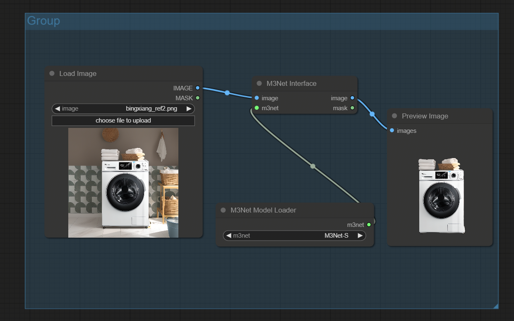

# ComfyUI nodes to use M3net

https://github.com/I2-Multimedia-Lab/M3Net

## Install

- 推荐使用管理器 ComfyUI Manager 安装（On the Way）

- 手动安装：
    1. `cd custom_nodes`
    2. `git clone https://github.com/leeguandong/ComfyUI_M3Net.git`
    3. 重启 ComfyUI

## Use

- Pre-calculated saliency maps: M3Net-R [uqsr], M3Net-S [6jyh]
Pre-trained weights: M3Net-R [m789], M3Net-S [4wnw]
  将权重下载到'/custom_nodes/ComfyUI_M3Net/weights'  
  我自己也开源了一个权重，一个很一般的微调版本，在电商场景上应该比很多模型都强了，==

- 节点：

   - M3Net Model Loader：自动加载 M3Net 模型
   - M3Net Interface：去除背景

## Stars 

